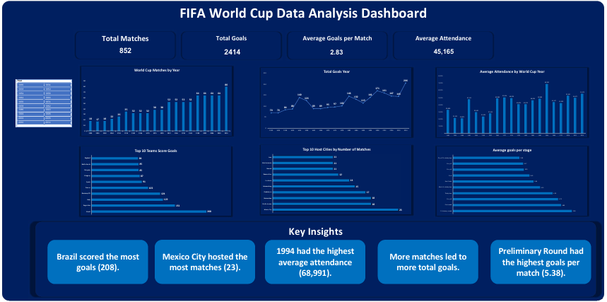

# FIFA World Cup Data Analysis Dashboard

An interactive FIFA World Cup Dashboard built using **Microsoft Excel**.  
The project analyzes historical FIFA World Cup data through KPIs, Pivot Tables, Pivot Charts, Slicers, and an interactive dashboard.

---

## Dashboard Preview

> Add a screenshot of the dashboard below.

---

## Project Overview

This project focuses on analyzing FIFA World Cup historical data using Microsoft Excel.

The dashboard provides interactive insights into:

- World Cup matches over the years
- Total goals scored
- Average goals per match
- Average attendance
- Top scoring teams
- Top host cities
- Tournament stage performance

---

## Tools Used

- Microsoft Excel
- Pivot Tables
- Pivot Charts
- Slicers
- Excel Functions
- Dashboard Design

---

## KPIs

- Total Matches
- Total Goals
- Average Goals per Match
- Average Attendance

---

## Dashboard Features

- World Cup Matches by Year
- Total Goals by Year
- Top 10 Teams by Total Goals
- Top 10 Host Cities
- Average Attendance by Year
- Average Goals per Stage
- Interactive Slicers
- Key Insights

---

## Key Insights

- Brazil scored the most goals (208).
- Mexico City hosted the most matches (23).
- 1994 had the highest average attendance (68,991).
- More matches led to more total goals.
- Preliminary Round had the highest goals per match (5.38).

---

## Project Files

| File | Description |
|------|-------------|
| WorldCupMatches.xlsx | Excel dashboard |
| Dashboard.pdf | Dashboard report |
| Dashboard.png | Dashboard preview |
| Dataset/ | Source dataset |

---

## Skills Demonstrated

- Data Cleaning
- Data Analysis
- Dashboard Design
- Data Visualization
- Business Insights
- Storytelling with Data

---

## Author

**Abdelrhman**

GitHub: https://github.com/abdelr7man3laa
